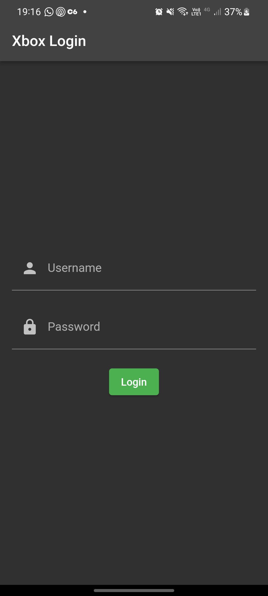

<!DOCTYPE html>
<html>
<body>
  <h1>x_axhievments</h1>
  
  
  
  
  
  

  
Welcome to x_axhievments - your ultimate game companion! This Flutter project is here to revolutionize the way you track your progress in games and celebrate your achievements. Say goodbye to the days of forgetting where you left off or missing out on your triumphs. With x_axhievments, you're always in the game!

  <h2>Getting Started</h2>

  
Get started with x_axhievments and dive into the world of Flutter development. Follow these steps to set up and run the project on your local machine:

 <ol>
    <li>
      
<strong>Clone the repository:</strong>

      <pre><code>git clone https://github.com/carlosManoelWendorff1/achivementsX.git</code></pre>
    </li>
    <li>
      
<strong>Navigate to the project directory:</strong>

      <pre><code>cd x_axhievments</code></pre>
    </li>
    <li>
      
<strong>Install dependencies:</strong>

      <pre><code>flutter pub get</code></pre>
    </li>
    <li>
      
<strong>Run the app:</strong>

      <pre><code>flutter run</code></pre>
    </li>
  </ol>

  
This command will launch the x_axhievments app on the connected device or simulator.

  <h2>Troubleshooting</h2>

  
Encountering issues or bugs? Here are some common troubleshooting steps:

  <ul>
    <li><strong>Flutter SDK:</strong> Ensure you have the Flutter SDK installed and configured properly. You can download it from the <a href="https://flutter.dev/docs/get-started/install">official Flutter website</a>.</li>
    <li><strong>Dependency Issues:</strong> If you face dependency-related problems, run the following command to update dependencies:</li>
    <pre><code>flutter pub upgrade</code></pre>
    <li><strong>Clean Build:</strong> Perform a clean build to ensure a fresh start:</li>
    <pre><code>flutter clean</code></pre>
    <pre><code>flutter pub get</code></pre>
    <pre><code>flutter run</code></pre>
    <li><strong>Device Connection:</strong> Make sure your device is properly connected or your emulator is running. Use <code>flutter devices</code> to list available devices and emulators.</li>
  </ul>

  
Now, let's embark on this gaming odyssey with x_axhievments and make every achievement a legendary milestone! 🚀🎮

</body>

</html>
